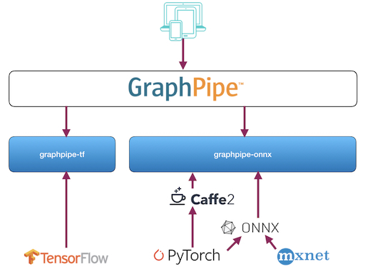

__Dead Simple ML Model Serving via a Standard Protocol__

# What is it?

GraphPipe is a protocol and collection of software designed to simplify machine
learning model deployment and decouple it from framework-specific model
implementations.

# Why did we make it?

We found existing solutions for model serving to be inconsistent and/or inefficient.
Without a consistent protocol for communicating with different model servers, 
it is often necessary to build custom clients for each workload. GraphPipe
solves these problems by standardizing on an efficient communication protocol
and providing simple model servers for the major ML frameworks.

We hope that open sourcing GraphPipe makes the model serving landscape a
friendlier place.  See more about why we built it
[here](guide/user-guide/overview).

# Features

* A minimalist machine learning transport specification based on [flatbuffers]
* Simple, efficient reference model servers for [Tensorflow], [Caffe2], and [ONNX].
* Efficient client implementations in Go, Python, and Java.

[flatbuffers]: https://google.github.io/flatbuffers/
[Tensorflow]: https://www.tensorflow.org
[Caffe2]: https://caffe2.ai
[ONNX]: https://onnx.ai

### Quick Navigation

- [Project Overview](guide/user-guide/overview.md)
- [Getting Started](guide/user-guide/quickstart.md)
- [GraphPipe Specification](guide/user-guide/spec.md)
- [Performance Measurements](guide/user-guide/performance.md)
- [Running a GraphPipe Server](guide/servers/overview.md)
- [Using GraphPipe Clients](guide/clients/overview.md)
