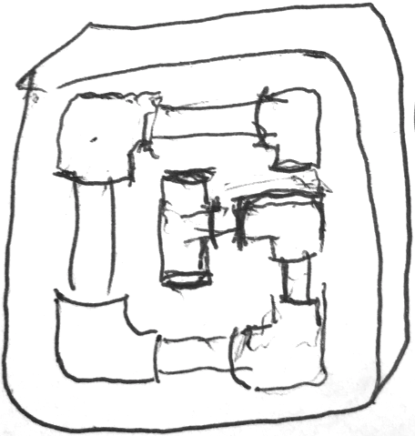

# graphpipe <small>1.0</small>

> Dead simple remote model serving

* A simple, light-weight, framework-agnostic protocol for remote tensor communication

[GitHub](https://github.com/oracle/graphpipe/)
[Get Started](#graphpipe)
