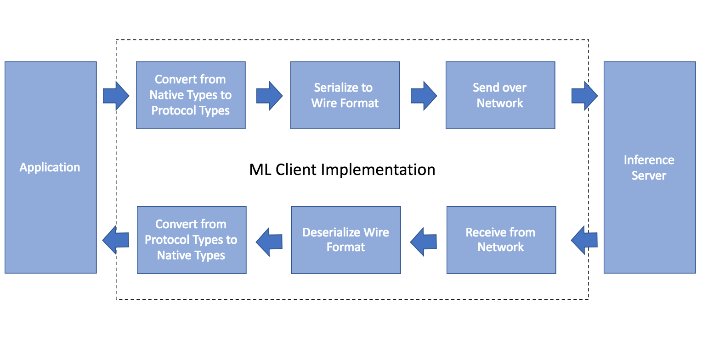

# Overview

In order to make it as easy as possible to integrate GraphPipe into your
application, we provide efficient client implementations for major programming
languages.

In general, the machine learning client's work looks something like this:

It is important for each of the steps in the dotted box to be implemented as
efficiently as possible.  GraphPipe is implemented with this efficiency in
mind.

At present, we provide client support for python, go, and java.
