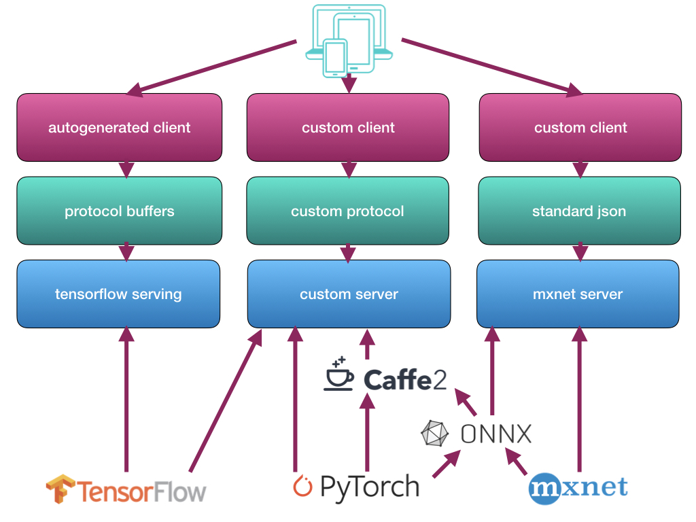
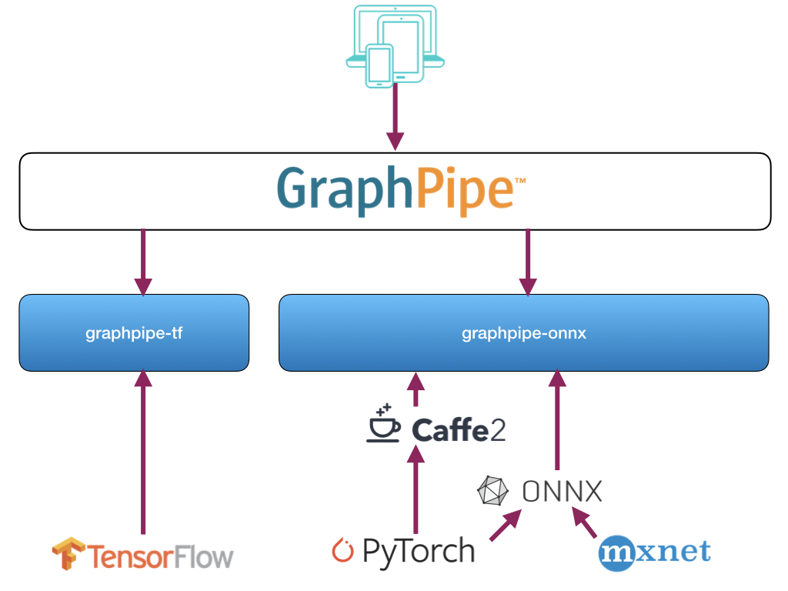

# Overview

In the process of our work deploying machine learning models, we ran into
several issues:

* Model serving network protocols were tied to underlying model implementations.
  If you had a Tensorflow model, for example, you needed to use tensorflow's 
  protocol buffer server (tensorflow-serving) to perform remote inference.
* Pytorch and Caffe2, on the other hand, do not provide an efficient model server
  in their codebase, but rely on tools like mxnet-model-server for remote inference,
  which is written in python and provides a json api without batch support.
  While this is good for simple use cases, it does not seem suitable for
  back-end infrastructure.
* ONNX exists, but tackles the vendor-coupling problem by standardizing model
  formats rather than protocol formats. This is useful but challenging, as 
  not all backend model formats have fully equivalent operations.
* For operators looking to sanely maintain infrastructure, having a standard way
  for front-end clients to talk to back-end machine-learning models,
  irrespective of model implementation, is important.

The current state of the world looks like the following:

Thus GraphPipe was born.  In the code that we are releasing we provide:

* A Standard Flatbuffers-based protocol for client-server Tensor communications
* Efficient Graphpipe Clients written in Go, Java, and Python
* Dead-simple efficient model servers written in Go for serving Tensorflow,
  Caffe2, and ONNX models.  More implementations to come.

Now our world looks like this:

