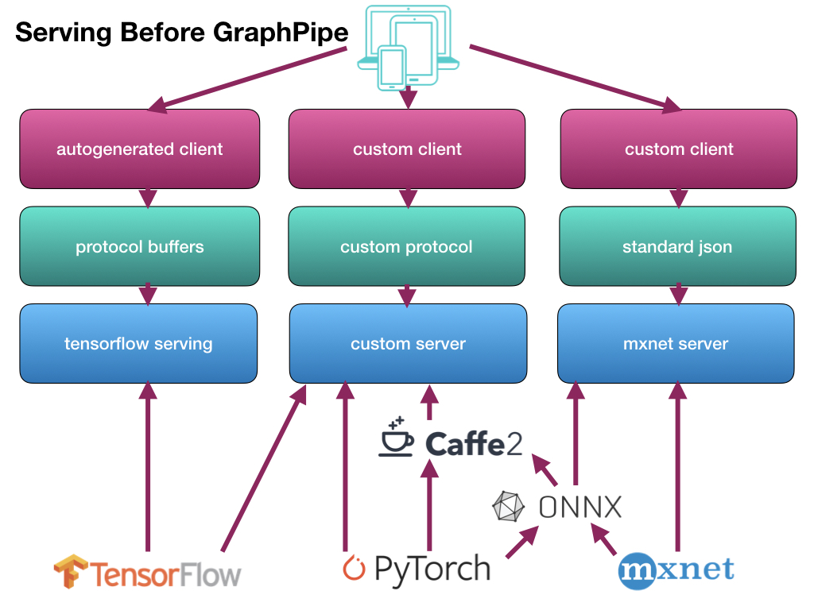
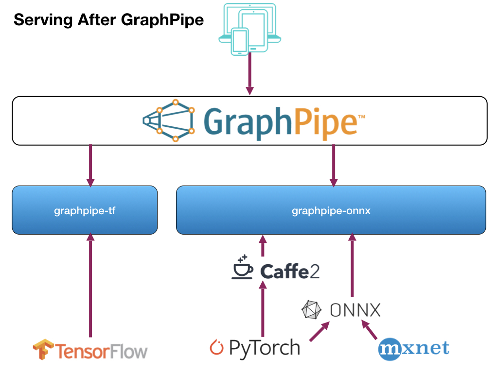

# Overview

While surveying the existing landscape of Machine Learning model serving, we
discovered:

* Model serving network protocols are tied to underlying model implementations.
  If you have a Tensorflow model, for example, you need to use tensorflow's
  protocol buffer server (tensorflow-serving) to perform remote inference.
* Pytorch and Caffe2, on the other hand, do not provide an efficient model
  server in their codebase, but rely on tools like mxnet-model-server for
  remote inference. mxnet-model-server is written in python and provides a json
  api without batch support.  While this is good for simple use cases, it is
  not suitable for back-end infrastructure.
* ONNX exists, but tackles the vendor-coupling problem by standardizing model
  formats rather than protocol formats. This is useful but challenging, as not
  all backend model formats have fully equivalent operations. This means a
  simple conversion doesn't always work, and sometimes a model rewrite is
  necessary.
* For operators looking to sanely maintain infrastructure, having a standard
  way for front-end clients to talk to back-end machine-learning models,
  irrespective of model implementation, is important.

In other words, serving models without GraphPipe is a huge pain:

In the code we are releasing we provide:

* A minimalist machine learning transport specification based on [flatbuffers]
* Simple, efficient reference model servers for [Tensorflow], [Caffe2], and [ONNX].
* Efficient client implementations in Go, Python, and Java.

[flatbuffers]: https://google.github.io/flatbuffers/
[Tensorflow]: https://www.tensorflow.org
[Caffe2]: https://caffe2.ai
[ONNX]: https://onnx.ai

With these tools, communication is streamlined and serving is simpler:

