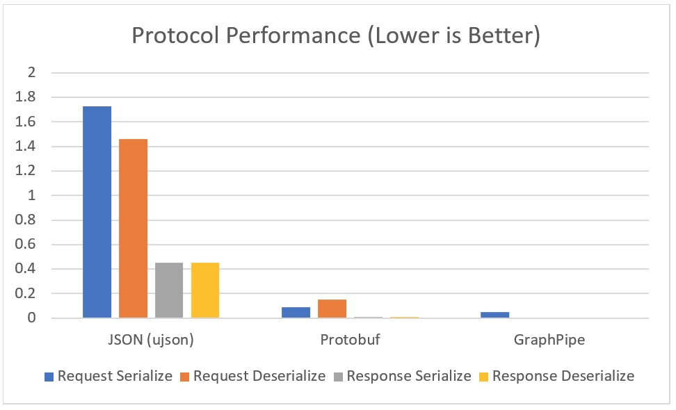
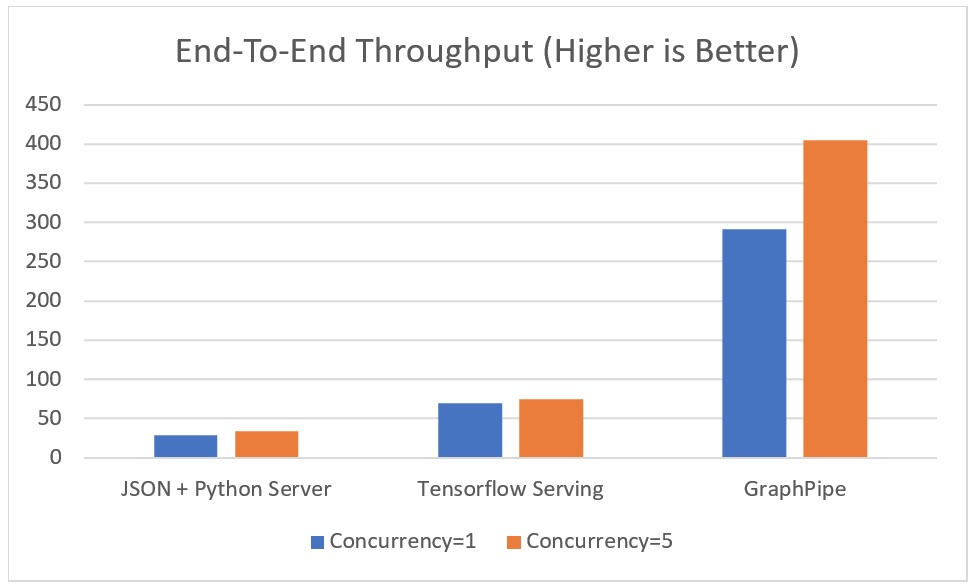

# Performance

First, we compare serialization and deserialization speed of float tensor data
in python using a custom ujson API, protocol buffers using a TensorFlow-serving
predict request, and a GraphPipe remote request. The request consisted of about
19 million floating-point values (consisting of 128 224x224x3 images) and the
response was approximately 3.2 million floating point values (consisting of 128
7x7x512 convolutional outputs). The units on the left are in seconds.

_GraphPipe is especially performant on the deserialize side, because
flatbuffers provide access to underlying data without a memory copy._

Second, we compare end-to-end throughput using a Python-JSON TensorFlow model
server, TensorFlow-serving, and the GraphPipe-go TensorFlow model server. In
each case the backend model was the same. Large requests were made to the
server using 1 thread and then again with 5 threads. The units on the left are
rows calculated by the model per second.

_Note that this test uses the recommended parameters for building
Tensorflow-serving. Although the recommended build parameters for
TensorFlow-serving do not perform well, we were ultimately able to discover
compilation parameters that allow it to perform on par with our GraphPipe
implementation. In other words, an optimized TensorFlow-serving performs
similarly to GraphPipe, although building TensorFlow-serving to perform
optimally is not documented nor easy._

